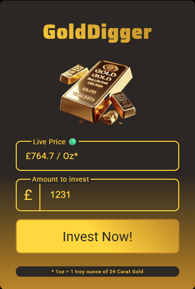
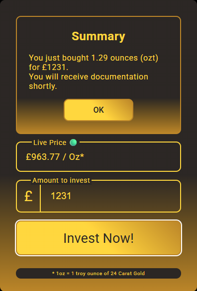
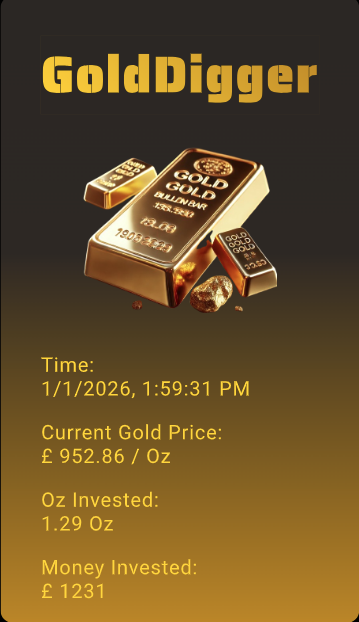
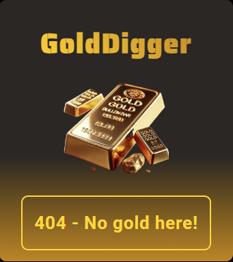

# Gold-Digger
A simple application of concepts learnt in developing a full stack application.

<div align='center'>
    
    
    
    
</div>

## Get Started
Step 1: ` git clone`

Step 2: Create an .env in the root folder with the following content:
```
GMAIL_USER = <Sender's gmail address>
GMAIL_PASS = <MAIL app password>
RECEIVE_USER = <Receiver's email address>
```
`GMAIL_PASS` value can be setup by here: https://myaccount.google.com/ at ***APP PASSWORDS*** using an app name of ***MAIL***

Step 3: `npm install`

Step 4: `node server.js`

Step 5: Visit `http:localhost:8000`

## Feature / Implementation
- Render static pages and assets from a backend node.js.
- Handle purchase request by the user in the form of API.
- Application of Server-Sent Event to update the gold price.
- Proper flow of backend design to send appropriate status code based on the client's request, including 
    * 200(ok)
    * 201(successful POST request)
    * 404(Bad request)
    * 500(server-side issue)
- Generate a Pdf (designed using html and css, captured using ***Puppeteer***) after the transaction is completed.
- Mocking the process of sending the generated pdf to the user (using ***nodemailer*** via personal gmail)

## Limitations
- The pdf generation and emailing process cannot be deployed using online backend hosting service (such as Render due to the free tier's memory limitations).
    * To try out these features locally, users are encouraged to follow the steps in GET STARTED. 